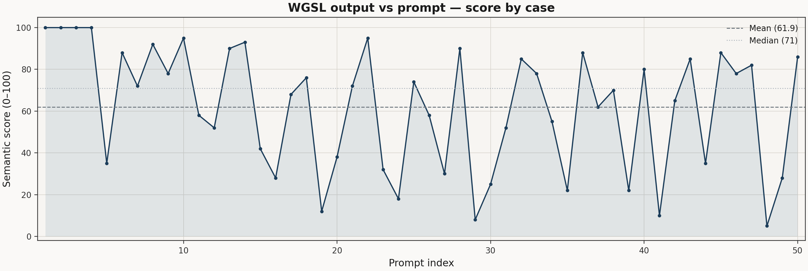
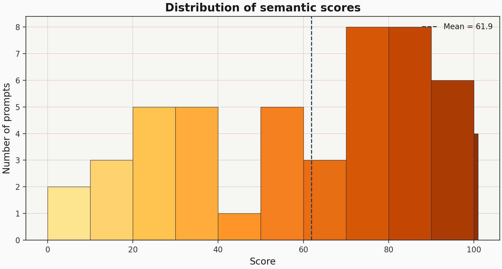
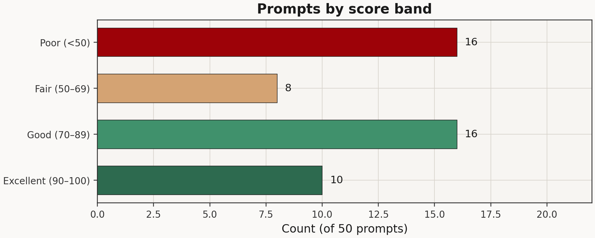
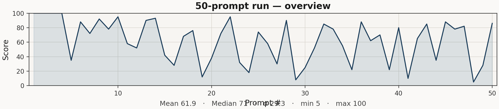
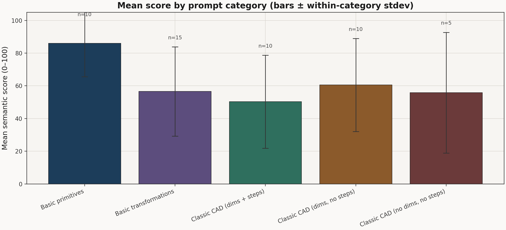
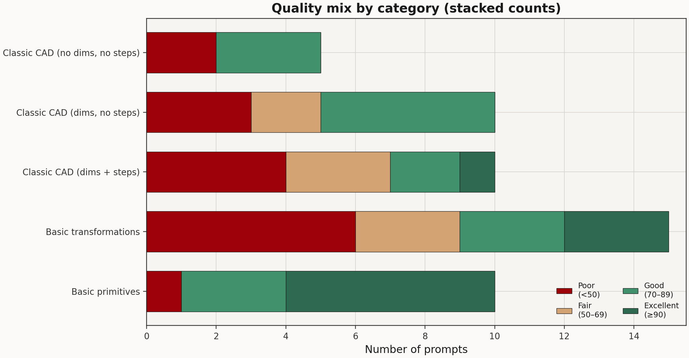

# Prompt suite — WGSL vs prompt (code-only)

Manual review of each generated `map()` in `outputs/` against its prompt and against the SDF helpers shipped in `web/src/webgpu_renderer.ts` (e.g. `sdCylinder(p, h, r)`, two-arg `opS` / `opU` / `opI`, `sdRoundBox`).

**Scores (0–100)** measure *semantic* fit: topology, primitives, and CSG story vs the prompt. Entries marked with API or WGSL issues would not run as-is in the viewer until aligned with the real library.

---

## At a glance

- **46** prompts in `test_50_prompts.py` — **five categories** (see table below). Multi-LLM benchmark: `EXPERIMENTS.md`, `run_multi_llm_benchmark.py`, `BENCHMARK_RATINGS.md`.
- Numeric summaries below are from an **earlier 50-prompt** scoring pass; **re-run** the harness and refresh `data/50_prompts_scores.json` for the new suite.
- Recurring issues (historical): **`sdCone` signature drift**, **`opS` arity**, **`let` reassignment**, invalid types, **topology** mistakes.

---

## Prompt categories

Aligned with `agent/experiments/test_50_prompts.py` (`PROMPTS` order). **Classic CAD** uses the **same ten parts** in four ablations: with steps → dims only → no dims → vague short.

| Category | Indices | Count | Role |
|----------|---------|-------|------|
| **Classic CAD (dims + steps)** | 1–10 | 10 | Numbers + numbered steps |
| **Classic CAD (dims, no steps)** | 11–20 | 10 | Declarative, measured |
| **Classic CAD (no dims, no steps)** | 21–30 | 10 | Qualitative only |
| **Classic CAD (vague)** | 31–40 | 10 | One-line prompts |
| **Organic (SDF)** | 41–46 | 6 | Smooth unions, ellipsoid, blobs |

**Classic CAD ten-part set:** L-bracket, I-beam, gear blank, flanged bearing, rivet, D-pull, eccentric cam, four-blade fan hub, hollow square tube, slotted grille.

---

## Figures

Regenerate (requires matplotlib):  
`python agent/experiments/plot_50_prompts_results.py`  
(Source numbers: `agent/experiments/data/50_prompts_scores.json`.)

### Scores by prompt index

Mean and median reference lines; each point is one prompt (1–71 after re-score).

### Distribution

Histogram of scores (10-point bins) with mean marked.

### Counts by band

How many prompts fell into each qualitative band.

### Compact overview

Sparkline of all scored prompts with summary statistics.

### Mean score by category

Average semantic score per category; error bars are the **within-category** sample standard deviation. Each bar is labeled with **n** (prompt count).

### Quality mix by category

Stacked counts: **Excellent** (≥90), **Good** (70–89), **Fair** (50–69), **Poor** (under 50). Segment order is Poor → Fair → Good → Excellent (left to right).

---

## Takeaways

Expect **classic CAD vague** (31–40) to stress interpretation; **organic** (41–46) stresses **smooth union** and continuity. Re-score after regenerating WGSL for all **46** prompts (and per-LLM under `outputs/by_model/`).

**Sources:** prompts in `agent/experiments/test_50_prompts.py`; WGSL in `agent/experiments/outputs/{nn}_*.wgsl`.

---

## Legacy detailed notes (50-prompt run; indices and names differ from current 71)

### Excellent — 90–100 (10 prompts)

- **#1 · Simple sphere** (`01_Simple_sphere.wgsl`) — **100**/100 — `sdSphere(p, 1.0)` matches.
- **#2 · Simple box** (`02_Simple_box.wgsl`) — **100**/100 — Half-extents `0.5` → 1.0 cube.
- **#3 · Simple cylinder** (`03_Simple_cylinder.wgsl`) — **100**/100 — `h=1.0` half-height → total height 2.0, `r=0.5`.
- **#4 · Simple torus** (`04_Simple_torus.wgsl`) — **100**/100 — `vec2f(1.0, 0.2)` matches major/minor.
- **#10 · Thin sheet** (`10_Thin_sheet.wgsl`) — **95**/100 — Thin `sdBox`; aspect ratio matches.
- **#22 · Lens shape** (`22_Lens_shape.wgsl`) — **95**/100 — Two spheres `opI` → lens.
- **#14 · Swiss cheese block** (`14_Swiss_cheese_block.wgsl`) — **93**/100 — Cube minus spheres on six sides.
- **#8 · Hexagonal prism** (`08_Hexagonal_prism.wgsl`) — **92**/100 — `sdHexPrism` usage matches.
- **#13 · Square frame** (`13_Square_frame.wgsl`) — **90**/100 — Outer/inner box subtraction; reasonable frame.
- **#28 · Dumbbell profile** (`28_Dumbbell_profile.wgsl`) — **90**/100 — Cylinder + end spheres.

### Good — 70–89 (16 prompts)

- **#6 · Simple capsule** (`06_Simple_capsule.wgsl`) — **88**/100 — Capsule along Y with end spheres; sensible proportions.
- **#36 · I-beam** (`36_I-beam.wgsl`) — **88**/100 — Web + flanges as boxes; clear I.
- **#45 · Rivet head** (`45_Rivet_head.wgsl`) — **88**/100 — Short cylinder + dome on top.
- **#50 · Half pipe** (`50_Half_pipe.wgsl`) — **86**/100 — Hollow cylinder ∩ half-space → half pipe.
- **#32 · Pill shape** (`32_Pill_shape.wgsl`) — **85**/100 — `sdCapsule` good stand-in for pill.
- **#43 · Hex wrench** (`43_Hex_wrench.wgsl`) — **85**/100 — Two hex prisms, second rotated.
- **#47 · Wheel rim** (`47_Wheel_rim.wgsl`) — **82**/100 — Torus + hub + four radial spokes.
- **#40 · Splined shaft blank** (`40_Splined_shaft_blank.wgsl`) — **80**/100 — Shaft + four radial bumps.
- **#9 · Triangular prism** (`09_Triangular_prism.wgsl`) — **78**/100 — Custom extruded triangular SDF; plausible, not library-tested.
- **#33 · L-shaped bracket** (`33_L-shaped_bracket.wgsl`) — **78**/100 — Two `sdRoundBox` legs; reasonable L.
- **#46 · Signet ring** (`46_Signet_ring.wgsl`) — **78**/100 — Torus + box for flat face; coarse.
- **#18 · Keyhole slot** (`18_Keyhole_slot.wgsl`) — **76**/100 — Circle + slot subtracted; not strict 2D keyhole extrusion.
- **#25 · Crescent moon** (`25_Crescent_moon.wgsl`) — **74**/100 — Cylinder minus shifted cylinder; not clear Z extrusion.
- **#7 · Rounded box** (`07_Rounded_box.wgsl`) — **72**/100 — Right idea; small `0.2` cube vs generic “cube” scale.
- **#21 · Crossed pipes** (`21_Crossed_pipes.wgsl`) — **72**/100 — Two hollow cylinders rotated; inner/outer heights inconsistent.
- **#38 · Gear blank** (`38_Gear_blank.wgsl`) — **70**/100 — Disc minus holes; disc **thin** in Y vs “thick disc”.

### Fair — 50–69 (8 prompts)

- **#17 · Counterbored hole plate** (`17_Counterbored_hole_plate.wgsl`) — **68**/100 — Counterbore + through hole interpretable; plate fairly thick.
- **#42 · Flanged bearing** (`42_Flanged_bearing.wgsl`) — **65**/100 — Hollow + flange; inner cylinder taller than outer.
- **#37 · C-clamp body** (`37_C-clamp_body.wgsl`) — **62**/100 — Round block minus slot; loose C-clamp.
- **#11 · Hollow pipe** (`11_Hollow_pipe.wgsl`) — **58**/100 — Shell idea; **inner half-height `0.6` > outer `0.5`** breaks wall.
- **#26 · Step pyramid** (`26_Step_pyramid.wgsl`) — **58**/100 — Three blocks overlap; not clean ziggurat.
- **#34 · T-shaped bracket** (`34_T-shaped_bracket.wgsl`) — **55**/100 — Parts **separated in Y** → likely **disjoint**, not one T.
- **#12 · Bowl shape** (`12_Bowl_shape.wgsl`) — **52**/100 — Crude hemisphere clip; **inner full sphere**, not inner hemisphere.
- **#31 · Star profile** (`31_Star_profile.wgsl`) — **52**/100 — Five radial **boxes**, not triangular wedges.

### Poor — below 50 (16 prompts)

- **#15 · Stepped bore** (`15_Stepped_bore.wgsl`) — **42**/100 — **`opU` of two cylinders** → one void, not stepped bore.
- **#20 · U-channel** (`20_U-channel.wgsl`) — **38**/100 — Subtracts centered box: **closed tunnel**, not open U.
- **#5 · Simple cone** (`05_Simple_cone.wgsl`) — **35**/100 — Intent (angle from r/h) fine; **`sdCone(p, vec2f, h)` wrong** for library (`sdCone(p, h, r)`).
- **#44 · Chain link side** (`44_Chain_link_side.wgsl`) — **35**/100 — Hole capsules **degenerate segment** (same endpoints).
- **#23 · Wedge** (`23_Wedge.wgsl`) — **32**/100 — **`sdBox` zero half-extent** degenerate; weak wedge.
- **#27 · Hourglass** (`27_Hourglass.wgsl`) — **30**/100 — Two cones meeting; **`sdCone` API wrong**.
- **#16 · Countersunk hole plate** (`16_Countersunk_hole_plate.wgsl`) — **28**/100 — **`sdCone` wrong signature**, **`opS` 3 args**, countersink off.
- **#49 · Cone with flat top** (`49_Cone_with_flat_top.wgsl`) — **28**/100 — Frustum idea OK; **`sdCone` wrong signature**.
- **#30 · Tapered nozzle** (`30_Tapered_nozzle.wgsl`) — **25**/100 — Story OK; **`sdCone` signature wrong** throughout.
- **#35 · Gusset plate** (`35_Gusset_plate.wgsl`) — **22**/100 — **Rectangular** plate, not triangular gusset.
- **#39 · Threaded rod blank** (`39_Threaded_rod_blank.wgsl`) — **22**/100 — **`opU` adds lump**; cylinder **r=1.0** not “thin”.
- **#24 · Dice block** (`24_Dice_block.wgsl`) — **18**/100 — **`let d` reassigned** → invalid WGSL.
- **#19 · V-groove block** (`19_V-groove_block.wgsl`) — **12**/100 — **`let trench` reassigned** → invalid WGSL; wrong `sdCone` API.
- **#41 · Cam lobe** (`41_Cam_lobe.wgsl`) — **10**/100 — **`sdRoundBox(p.xy, vec3f(...))`** type mismatch.
- **#29 · Domed cylinder** (`29_Domed_cylinder.wgsl`) — **8**/100 — **`sdSphere(p.yz, …)`** type error; need `vec3f`.
- **#48 · Propeller blade blank** (`48_Propeller_blade_blank.wgsl`) — **5**/100 — **Prose after function** → file broken.
