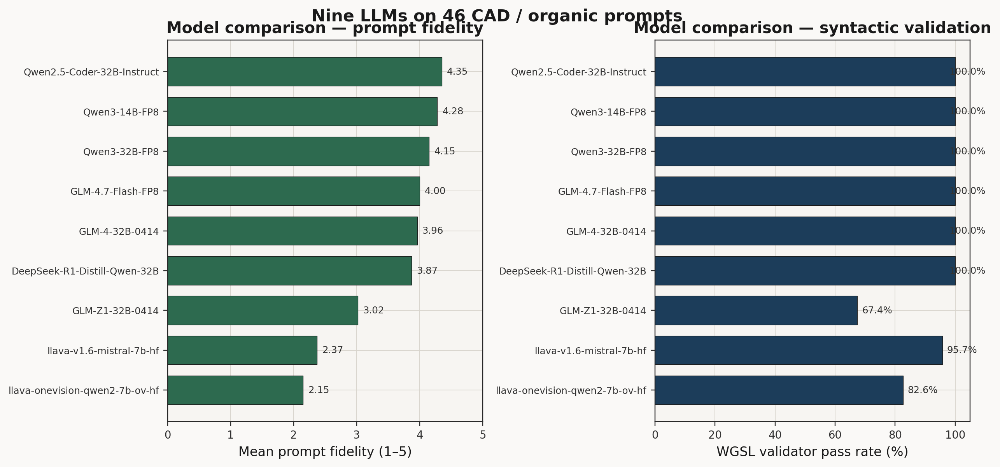
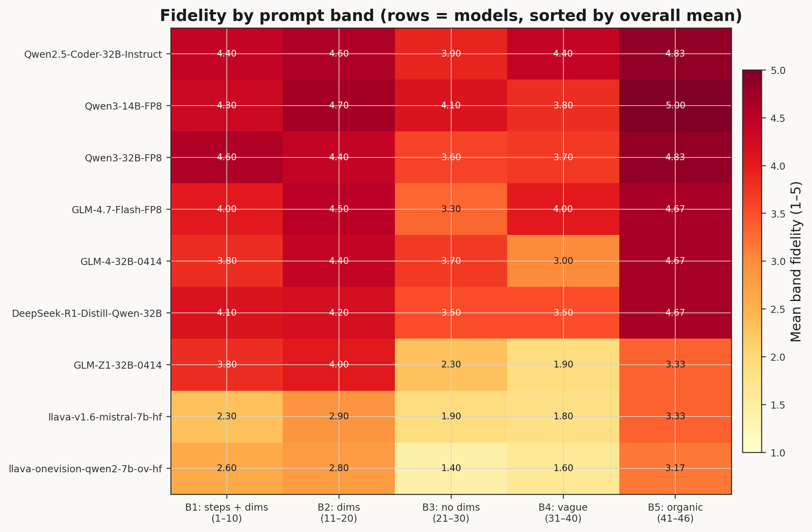
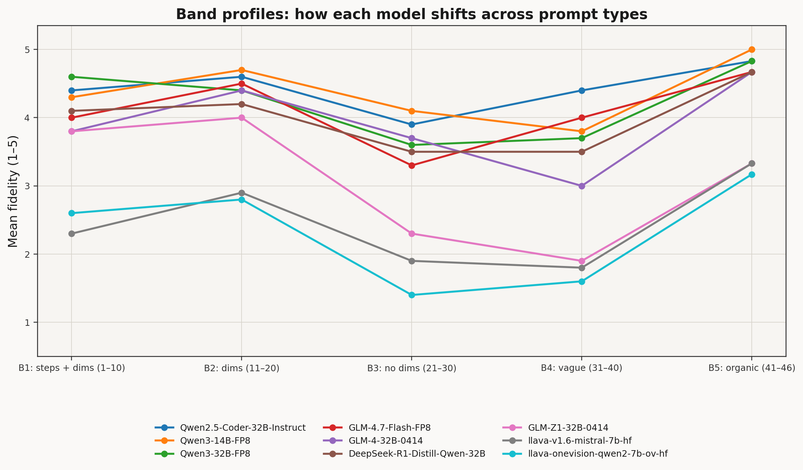

# LLM benchmark — validation and prompt-fidelity report

Generated by `aggregate_benchmark_ratings.py` from `outputs/by_model/*/results.json` and merged with `outputs/by_model/*/accuracy_ratings.json` when present.

## What the two scores measure

### Syntactic validation (automated)

Fraction of the 46 prompts where the returned `map()` passes `wgsl_validator` (allowed SDF helpers, balanced delimiters, no forbidden patterns). **Grade:** A≥90%, B≥75%, C≥50%, D≥25%, F<25%.

### Prompt fidelity (manual code review)

Mean score **1–5** per prompt: how well does the result actually match the prompt geometrically? (not just syntax). **0** = no usable output for that prompt. Per-prompt notes and rubric live in each model folder’s `accuracy_ratings.json`.

**We split the prompts into bands:** B1 = prompts 1–10 (measured + steps), B2 = 11–20 (measured), B3 = 21–30 (no numbers), B4 = 31–40 (vague), B5 = 41–46 (organic).

---

## 1. Syntactic validation ranking

| Rank | Model | Valid WGSL % | Any code % | Mean len (valid) | Grade |
|------|-------|-------------|------------|------------------|-------|
| 1 | Qwen2.5-Coder-32B-Instruct | **100.0%** | 100.0% | 284 | A |
| 2 | Qwen3-14B-FP8 | **100.0%** | 100.0% | 258 | A |
| 3 | Qwen3-32B-FP8 | **100.0%** | 100.0% | 271 | A |
| 4 | DeepSeek-R1-Distill-Qwen-32B | **100.0%** | 100.0% | 286 | A |
| 5 | GLM-4.7-Flash-FP8 | **100.0%** | 100.0% | 285 | A |
| 6 | GLM-4-32B-0414 | **100.0%** | 100.0% | 284 | A |
| 7 | llava-v1.6-mistral-7b-hf | **95.7%** | 95.7% | 224 | A |
| 8 | llava-onevision-qwen2-7b-ov-hf | **82.6%** | 82.6% | 243 | B |
| 9 | GLM-Z1-32B-0414 | **67.4%** | 67.4% | 260 | C |

## Figures

Regenerate after `aggregate_benchmark_ratings.py` (so `benchmark_aggregate.json` is current):

```bash
pip install -r agent/experiments/requirements-plots.txt   # matplotlib + numpy
python3 agent/experiments/plot_benchmark_comparison.py
```








## 2. Prompt-fidelity ranking

| Rank | Model | Mean / 5 | B1 | B2 | B3 | B4 | B5 | # prompts @ score 0 |
|------|-------|----------|----|----|----|----|----|------------------------|
| 1 | Qwen2.5-Coder-32B-Instruct | **4.35** | 4.40 | 4.60 | 3.90 | 4.40 | 4.83 | 0 |
| 2 | Qwen3-14B-FP8 | **4.28** | 4.30 | 4.70 | 4.10 | 3.80 | 5.00 | 0 |
| 3 | Qwen3-32B-FP8 | **4.15** | 4.60 | 4.40 | 3.60 | 3.70 | 4.83 | 0 |
| 4 | GLM-4.7-Flash-FP8 | **4.00** | 4.00 | 4.50 | 3.30 | 4.00 | 4.67 | 0 |
| 5 | GLM-4-32B-0414 | **3.96** | 3.80 | 4.40 | 3.70 | 3.00 | 4.67 | 0 |
| 6 | DeepSeek-R1-Distill-Qwen-32B | **3.87** | 4.10 | 4.20 | 3.50 | 3.50 | 4.67 | 0 |
| 7 | GLM-Z1-32B-0414 | **3.02** | 3.80 | 4.00 | 2.30 | 1.90 | 3.33 | 15 |
| 8 | llava-v1.6-mistral-7b-hf | **2.37** | 2.30 | 2.90 | 1.90 | 1.80 | 3.33 | 2 |
| 9 | llava-onevision-qwen2-7b-ov-hf | **2.15** | 2.60 | 2.80 | 1.40 | 1.60 | 3.17 | 8 |


## 3. Side-by-side summary

Sorted by **prompt-fidelity mean** (highest first). Validation % shows whether the string-level checker agreed; it does not guarantee correct axes or dimensions.

| Model | Valid WGSL % | Fidelity mean | Grade |
|-------|-------------|---------------|-------|
| Qwen2.5-Coder-32B-Instruct | 100.0% | 4.35 | A |
| Qwen3-14B-FP8 | 100.0% | 4.28 | A |
| Qwen3-32B-FP8 | 100.0% | 4.15 | A |
| GLM-4.7-Flash-FP8 | 100.0% | 4.00 | A |
| GLM-4-32B-0414 | 100.0% | 3.96 | A |
| DeepSeek-R1-Distill-Qwen-32B | 100.0% | 3.87 | A |
| GLM-Z1-32B-0414 | 67.4% | 3.02 | C |
| llava-v1.6-mistral-7b-hf | 95.7% | 2.37 | A |
| llava-onevision-qwen2-7b-ov-hf | 82.6% | 2.15 | B |

## 4. Short conclusions

- **Strongest validation pass rate:** Qwen2.5-Coder-32B-Instruct at 100.0% (several models tie at 100%).
- **Highest prompt-fidelity mean:** Qwen2.5-Coder-32B-Instruct at **4.35** / 5.
- **Lowest prompt-fidelity mean:** llava-onevision-qwen2-7b-ov-hf at **2.15** / 5 (8 prompts scored 0 — no output).
- **Validation vs fidelity:** a model can score 100% on `wgsl_validator` while still misplacing cylinders (wrong axis), halving dimensions, or using polar repetition for linear slots; check `accuracy_ratings.json` for those patterns.

## Model IDs (Hugging Face)

- **Qwen2.5-Coder-32B-Instruct:** `Qwen/Qwen2.5-Coder-32B-Instruct`
- **Qwen3-14B-FP8:** `Qwen/Qwen3-14B-FP8`
- **Qwen3-32B-FP8:** `Qwen/Qwen3-32B-FP8`
- **DeepSeek-R1-Distill-Qwen-32B:** `deepseek-ai/DeepSeek-R1-Distill-Qwen-32B`
- **GLM-4.7-Flash-FP8:** `marksverdhei/GLM-4.7-Flash-FP8`
- **GLM-4-32B-0414:** `zai-org/GLM-4-32B-0414`
- **llava-v1.6-mistral-7b-hf:** `llava-hf/llava-v1.6-mistral-7b-hf`
- **llava-onevision-qwen2-7b-ov-hf:** `llava-hf/llava-onevision-qwen2-7b-ov-hf`
- **GLM-Z1-32B-0414:** `THUDM/GLM-Z1-32B-0414`

## Source artifacts

- `outputs/by_model/<slug>/results.json` — per-prompt validation and code lengths.
- `outputs/by_model/<slug>/accuracy_ratings.json` — per-prompt fidelity scores and notes.
